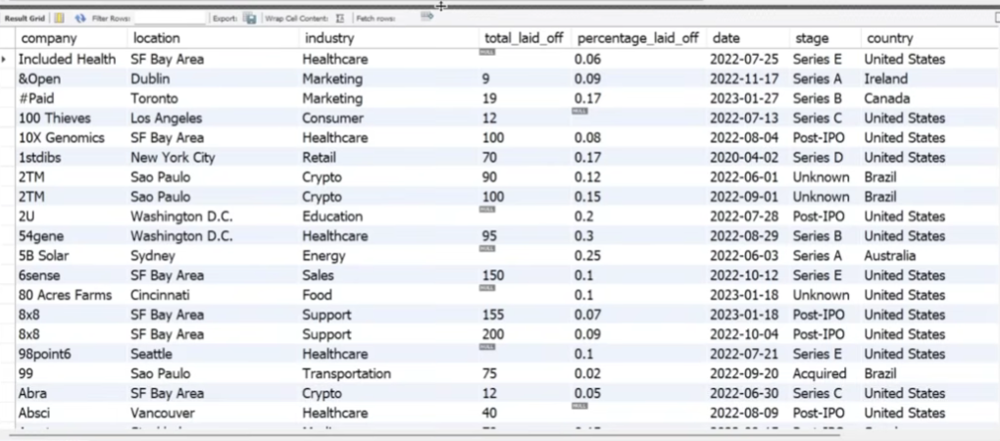

# SQL Layoffs Analysis – Data Cleaning & EDA

## Project Overview
This project analyzes tech industry layoffs to understand patterns across companies, industries, and time periods. The analysis is built in **MySQL** using raw layoffs data that was cleaned and transformed for exploratory data analysis (EDA).

The final output answers real-world business questions such as:
- Which companies laid off the most employees?
- Which industries were hit hardest by layoffs?
- How have layoffs trended monthly and yearly?
- What are the top companies by layoffs each year?

## Dataset Description
The dataset contains company layoff information including:
- Company name
- Location and country
- Industry
- Total laid off and percentage laid off
- Date of layoff
- Company stage and funds raised

## Important Notes About the Data
- Created database `world_layoffs` and imported `layoffs.csv` into raw `layoffs` table
- Raw data contained duplicates, inconsistent formatting, and missing values
- Data cleaning creates standardized `layoffs_staging2` table for analysis

## Data Preparation & Cleaning Steps
- Created staging tables for safe transformations
- **Removed duplicates** using ROW_NUMBER() partitioned by all key columns
- **Standardized values**:
  - TRIM(company) to remove extra spaces
  - Fixed 'Crypto%' → 'Crypto'
  - Fixed 'United States.' → 'United States'
  - Converted date format with STR_TO_DATE()
- **Handled NULLs/Blanks**:
  - Self-join to fill blank industries from matching companies
  - Deleted rows where both total_laid_off AND percentage_laid_off were NULL
- Verified data integrity with COUNT checks and sample validation

This process ensured accurate analysis and reliable results.

## Analysis Created

### 1. Total Layoffs by Company
Ranks companies by total employees laid off
Identifies repeat offenders across multiple years

### 2. Industry Breakdown Analysis
Shows most affected industries (Crypto heavily impacted)
Compares layoff scale across sectors

### 3. Country and Location Analysis
US vs international layoff patterns
Geographic distribution of tech layoffs

### 4. Monthly Rolling Totals
Time-series trend using SUM() OVER(ORDER BY MONTH)
Reveals seasonal layoff patterns

### 5. Yearly Company Rankings
Top 5 companies per year using DENSE_RANK() OVER(PARTITION BY years)
Shows changing leaders over time

## Analysis Use Case
This analysis is designed from a business decision-making perspective:
"If I were hiring in tech, which companies and industries show stability patterns?"

It helps users:
- Assess company risk and stability
- Understand industry hiring trends
- Identify seasonal layoff patterns
- Support data-driven recruitment strategies

## Tools Used
- **MySQL** – Complete data processing and analysis
- **Window functions** – Rolling totals and rankings
- **CTEs** – Complex multi-step analysis
- **Layoffs dataset** – Real-world tech industry data

## Key Insights & Conclusion
- Some companies laid off **100%** of staff (percentage_laid_off = 1)
- **Crypto industry** suffered most severe cuts
- Clear **monthly/seasonal patterns** in layoff timing
- Different companies lead layoffs rankings each year
- Advanced SQL cleaning significantly improved analysis accuracy

## Complete Setup Instructions
1. **Create database**:


2. **Import layoffs.csv** (MySQL Workbench: Server → Data Import)
3. **Run scripts in exact order**:
   - Data-Cleaning-Project.sql
   - Exploratory-Data-Analysis-EDA.sql

## Files
- `Data-Cleaning-Project.sql`
- `Exploratory-Data-Analysis-EDA.sql`
- `README.md`

---

**Created by:** Milena Cernjanski

## Data Cleaning Final Output


## Example of EDA Query - Ranking Query
```sql
WITH Company_Year_Rank AS
(
  SELECT company, YEAR(date) as years, SUM(total_laid_off) as total_laid_off,
  DENSE_RANK() OVER (PARTITION BY YEAR(date) ORDER BY SUM(total_laid_off) DESC) AS Ranking
  FROM layoffs_staging2
  WHERE YEAR(date) IS NOT NULL
  GROUP BY company, YEAR(date)
)
SELECT *
FROM Company_Year_Rank
WHERE Ranking <= 5
ORDER BY years, Ranking;
